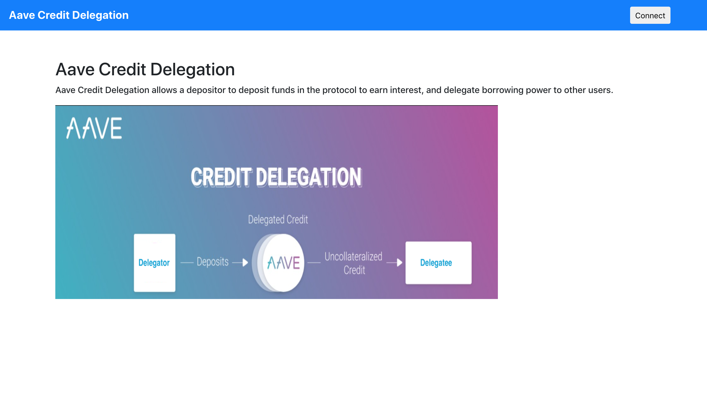
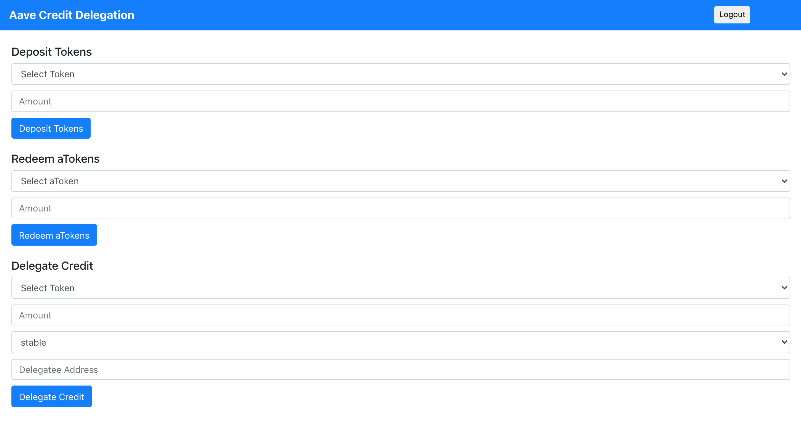
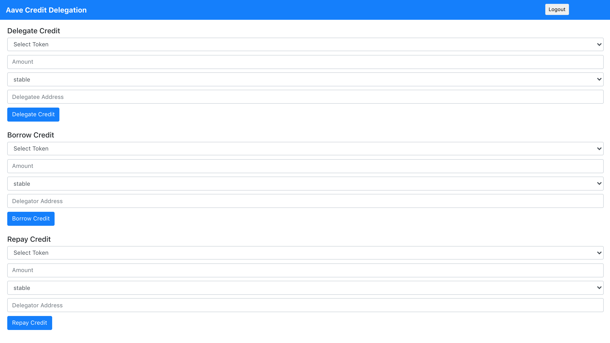

## Aave Credit Delegation
Aave Credit Delegation allows a depositor to deposit funds in the protocol to earn interest, and delegate borrowing power (i.e. their credit) to other users.

### App Link
Aave Credit Delegation (Kovan Network) - https://aave-credit-delegation.netlify.app/

### Screenshots







### Getting Started

1) Clone the repo

   ```
   git clone https://github.com/viraja1/aave_credit_delegation.git 
   ```

2) Change Directory

   ```
   cd aave_credit_delegation
   ```
   
3) Install packages

   ```
   npm install
   ```
   
4) Start the app   

   ```
   npm start 
   ```
   
5) Test the app

   http://localhost:3000/ 
   
6) Get tokens from faucet
    
   https://faucet.kovan.network/
   
   https://testnet.aave.com/faucet